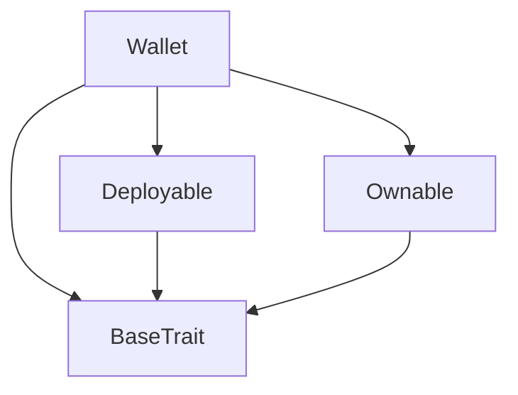
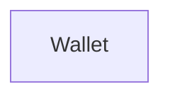

# TACT Compilation Report
Contract: Wallet
BOC Size: 2078 bytes

# Types
Total Types: 30

## StateInit
TLB: `_ code:^cell data:^cell = StateInit`
Signature: `StateInit{code:^cell,data:^cell}`

## Context
TLB: `_ bounced:bool sender:address value:int257 raw:^slice = Context`
Signature: `Context{bounced:bool,sender:address,value:int257,raw:^slice}`

## SendParameters
TLB: `_ bounce:bool to:address value:int257 mode:int257 body:Maybe ^cell code:Maybe ^cell data:Maybe ^cell = SendParameters`
Signature: `SendParameters{bounce:bool,to:address,value:int257,mode:int257,body:Maybe ^cell,code:Maybe ^cell,data:Maybe ^cell}`

## Deploy
TLB: `deploy#946a98b6 queryId:uint64 = Deploy`
Signature: `Deploy{queryId:uint64}`

## DeployOk
TLB: `deploy_ok#aff90f57 queryId:uint64 = DeployOk`
Signature: `DeployOk{queryId:uint64}`

## FactoryDeploy
TLB: `factory_deploy#6d0ff13b queryId:uint64 cashback:address = FactoryDeploy`
Signature: `FactoryDeploy{queryId:uint64,cashback:address}`

## ChangeOwner
TLB: `change_owner#819dbe99 queryId:uint64 newOwner:address = ChangeOwner`
Signature: `ChangeOwner{queryId:uint64,newOwner:address}`

## ChangeOwnerOk
TLB: `change_owner_ok#327b2b4a queryId:uint64 newOwner:address = ChangeOwnerOk`
Signature: `ChangeOwnerOk{queryId:uint64,newOwner:address}`

## UpgradeCode
TLB: `upgrade_code#000a2c2a newCode:^cell = UpgradeCode`
Signature: `UpgradeCode{newCode:^cell}`

## UpgradeChildCode
TLB: `upgrade_child_code#000a2c2b address:address newCode:^cell = UpgradeChildCode`
Signature: `UpgradeChildCode{address:address,newCode:^cell}`

## Transfer
TLB: `transfer#0f8a7ea5 queryId:uint64 amount:coins destination:address responseDestination:address customPayload:Maybe ^cell forwardTonAmount:coins forwardPayload:Maybe ^cell = Transfer`
Signature: `Transfer{queryId:uint64,amount:coins,destination:address,responseDestination:address,customPayload:Maybe ^cell,forwardTonAmount:coins,forwardPayload:Maybe ^cell}`

## InternalTransfer
TLB: `internal_transfer#178d4519 queryId:uint64 amount:coins from:address responseAddress:address forwardTonAmount:coins forwardPayload:Maybe ^cell = InternalTransfer`
Signature: `InternalTransfer{queryId:uint64,amount:coins,from:address,responseAddress:address,forwardTonAmount:coins,forwardPayload:Maybe ^cell}`

## TransferNotification
TLB: `transfer_notification#7362d09c queryId:uint64 amount:coins sender:address forwardPayload:Maybe ^cell = TransferNotification`
Signature: `TransferNotification{queryId:uint64,amount:coins,sender:address,forwardPayload:Maybe ^cell}`

## Burn
TLB: `burn#595f07bc queryId:uint64 amount:coins responseDestination:address customPayload:Maybe ^cell = Burn`
Signature: `Burn{queryId:uint64,amount:coins,responseDestination:address,customPayload:Maybe ^cell}`

## BurnNotification
TLB: `burn_notification#7bdd97de queryId:uint64 amount:coins sender:address responseDestination:address = BurnNotification`
Signature: `BurnNotification{queryId:uint64,amount:coins,sender:address,responseDestination:address}`

## Excesses
TLB: `excesses#d53276db queryId:uint64 = Excesses`
Signature: `Excesses{queryId:uint64}`

## UpdateTokenContent
TLB: `update_token_content#00030d40 content:Maybe ^cell = UpdateTokenContent`
Signature: `UpdateTokenContent{content:Maybe ^cell}`

## ProvideWalletAddress
TLB: `provide_wallet_address#2c76b973 queryId:uint64 ownerAddress:address includeAddress:bool = ProvideWalletAddress`
Signature: `ProvideWalletAddress{queryId:uint64,ownerAddress:address,includeAddress:bool}`

## TakeWalletAddress
TLB: `take_wallet_address#d1735400 queryId:uint64 walletAddress:address ownerAddress:Maybe address = TakeWalletAddress`
Signature: `TakeWalletAddress{queryId:uint64,walletAddress:address,ownerAddress:Maybe address}`

## MasterSetInfo
TLB: `master_set_info#00061a80 name:^string description:^string symbol:^string decimals:^string manager:address image:Maybe ^string = MasterSetInfo`
Signature: `MasterSetInfo{name:^string,description:^string,symbol:^string,decimals:^string,manager:address,image:Maybe ^string}`

## MasterUpdateManager
TLB: `master_update_manager#0001e0f6 manager:address = MasterUpdateManager`
Signature: `MasterUpdateManager{manager:address}`

## MasterUpdatePublicKey
TLB: `master_update_public_key#0001e0f7 pub:uint256 = MasterUpdatePublicKey`
Signature: `MasterUpdatePublicKey{pub:uint256}`

## MasterWithdrawProfit
TLB: `master_withdraw_profit#0001e0f3 responseDestination:Maybe address amount:Maybe coins = MasterWithdrawProfit`
Signature: `MasterWithdrawProfit{responseDestination:Maybe address,amount:Maybe coins}`

## MasterBorrowNotification
TLB: `master_borrow_notification#000a2c34 queryId:uint64 amount:coins depositAmount:coins borrowAmount:coins leftOverFee:coins seqno:uint64 bridgeAddress:address receiverAddress:address forwardPayload:Maybe ^cell = MasterBorrowNotification`
Signature: `MasterBorrowNotification{queryId:uint64,amount:coins,depositAmount:coins,borrowAmount:coins,leftOverFee:coins,seqno:uint64,bridgeAddress:address,receiverAddress:address,forwardPayload:Maybe ^cell}`

## BorrowPayload
TLB: `_ price:uint32 date:uint32 id:uint32 vekselAddress:address signature:^slice = BorrowPayload`
Signature: `BorrowPayload{price:uint32,date:uint32,id:uint32,vekselAddress:address,signature:^slice}`

## JettonWalletData
TLB: `_ balance:coins owner:address master:address walletCode:^cell = JettonWalletData`
Signature: `JettonWalletData{balance:coins,owner:address,master:address,walletCode:^cell}`

## Wallet$Data
TLB: `null`
Signature: `null`

## JettonContentCell
TLB: `_ representation:uint8 content:dict<uint256, ^cell> = JettonContentCell`
Signature: `JettonContentCell{representation:uint8,content:dict<uint256, ^cell>}`

## JettonData
TLB: `_ totalSupply:coins mintable:bool adminAddress:address content:Maybe ^cell walletCode:^cell = JettonData`
Signature: `JettonData{totalSupply:coins,mintable:bool,adminAddress:address,content:Maybe ^cell,walletCode:^cell}`

## Master$Data
TLB: `null`
Signature: `null`

# Get Methods
Total Get Methods: 3

## msgValue
Argument: value

## get_wallet_data

## owner

# Error Codes
2: Stack underflow
3: Stack overflow
4: Integer overflow
5: Integer out of expected range
6: Invalid opcode
7: Type check error
8: Cell overflow
9: Cell underflow
10: Dictionary error
13: Out of gas error
32: Method ID not found
34: Action is invalid or not supported
37: Not enough TON
38: Not enough extra-currencies
128: Null reference exception
129: Invalid serialization prefix
130: Invalid incoming message
131: Constraints error
132: Access denied
133: Contract stopped
134: Invalid argument
135: Code of a contract was not found
136: Invalid address
137: Masterchain support is not enabled for this contract
2069: Signature is invalid
4429: Invalid sender
8086: Not enough funds
16059: Invalid value
21856: Only owner or manager can withdraw
23951: Insufficient gas
33752: Payload required
37606: Not enough funds for gas consumption
52756: Only master allowed
62972: Invalid balance

# Trait Inheritance Diagram

# Contract Dependency Diagram

